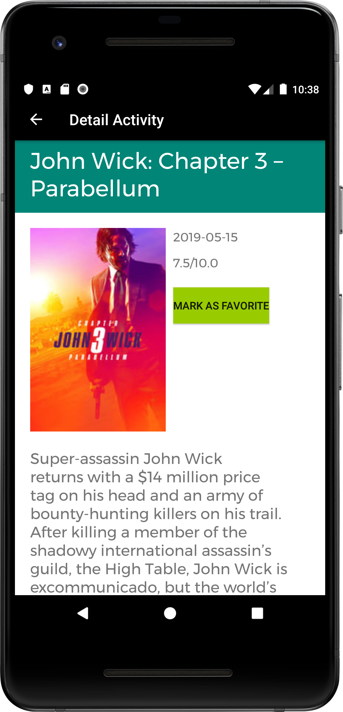
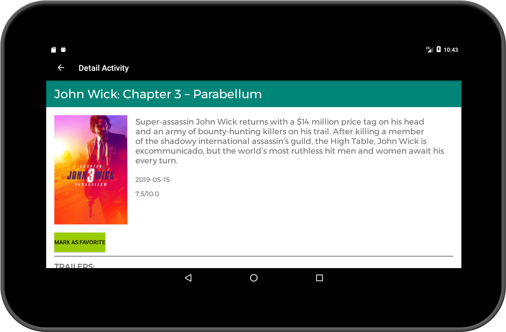

# Popular Movies app
Popular Movies app for Udacity Android Developer Nanodegree Program

# Description
Developed a Popular Movies app that allows users to discover the most popular movies playing

# Requirements
- Users can view and play trailers (either in the youtube app or a web browser).
- Users can read reviews of a selected movie.
- Users can mark a movie as a favorite in the details view by tapping a button. 
This is for a local movies collection that does not require an API request.
- User can sort movies by popular, top rated or favorites

# Additional libraries
- [Retrofit2](https://github.com/square/retrofit)
- [Glide](https://github.com/bumptech/glide)
- [Android Architecture Components: Room, LiveData, ViewModel](https://developer.android.com/topic/libraries/architecture)
- [Stetho](https://github.com/facebook/stetho)
- [Butter Knife](https://github.com/JakeWharton/butterknife) 

# Screenshots

<pre>PROJECT LICENSE

This project was submitted by Janas Chatkevicius as part of the Nanodegree At Udacity.

As part of Udacity Honor code, your submissions must be your own work, hence
submitting this project as yours will cause you to break the Udacity Honor Code
and the suspension of your account.

Me, the author of the project, allow you to check the code as a reference, but if
you submit it, it's your own responsibility if you get expelled.

Copyright (c) 2019 Janas Chatkevicius

Besides the above notice, the following license applies and this license notice
must be included in all works derived from this project.

MIT License

Permission is hereby granted, free of charge, to any person obtaining a copy
of this software and associated documentation files (the "Software"), to deal
in the Software without restriction, including without limitation the rights
to use, copy, modify, merge, publish, distribute, sublicense, and/or sell
copies of the Software, and to permit persons to whom the Software is
furnished to do so, subject to the following conditions:

The above copyright notice and this permission notice shall be included in all
copies or substantial portions of the Software.

THE SOFTWARE IS PROVIDED "AS IS", WITHOUT WARRANTY OF ANY KIND, EXPRESS OR
IMPLIED, INCLUDING BUT NOT LIMITED TO THE WARRANTIES OF MERCHANTABILITY,
FITNESS FOR A PARTICULAR PURPOSE AND NONINFRINGEMENT. IN NO EVENT SHALL THE
AUTHORS OR COPYRIGHT HOLDERS BE LIABLE FOR ANY CLAIM, DAMAGES OR OTHER
LIABILITY, WHETHER IN AN ACTION OF CONTRACT, TORT OR OTHERWISE, ARISING FROM,
OUT OF OR IN CONNECTION WITH THE SOFTWARE OR THE USE OR OTHER DEALINGS IN THE
SOFTWARE.
</pre>
